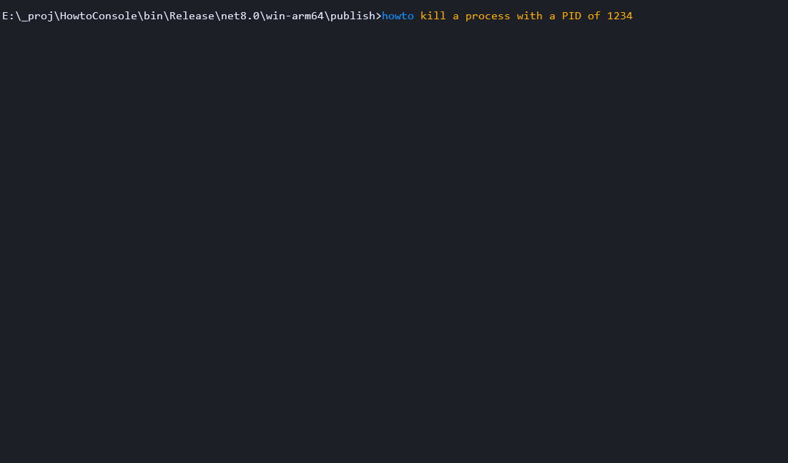

# HowToConsole

HowToConsole is a short program asking the OpenAI-compatible endpoint how to do
things in a console session, asking for a response in a form of one-liner and a
short description.



The program should be able to recognize what shell you are currently using (cmd,
pwsh, bash) and ask accordingly. The shell-recognition is very primitive and
Windows-only, as for now.

## Configuration

The configuration file `howtoconsole.appsettings.json` in a working directory
should provide some additional information about the API endpoint, API key, used
AI model and, optionally, a default shell used.

For example, you can customize it as such for a local ollama running codestral:

```json
{    
    "Url": "http://localhost:11434/v1/chat/completions",
    "Model": "codestral"
}
```
